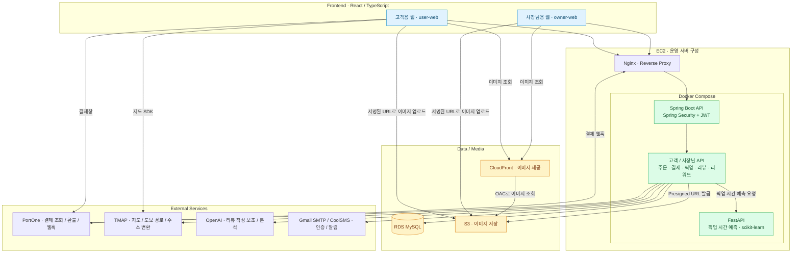
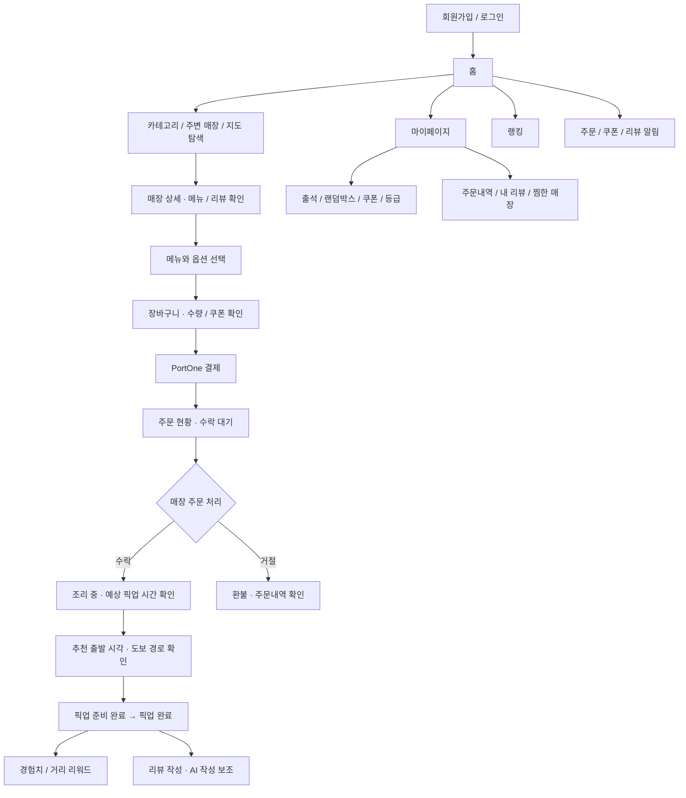
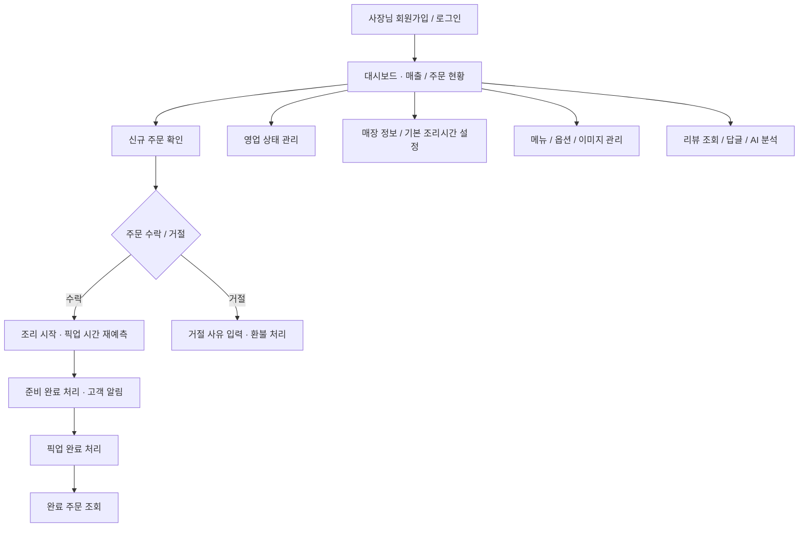
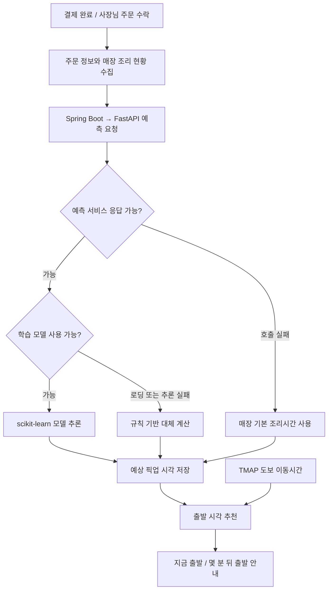

# 🛍️ 줍줍 · JubJub

> 주문부터 픽업까지, 내 출발 시간에 맞추는 포장 주문 서비스

**줍줍**은 주변 매장의 메뉴를 주문하고, 예상 픽업 시간과 도보 이동시간을 바탕으로 출발 시각을 안내받는 포장 주문 플랫폼입니다. 고객은 매장 탐색부터 결제, 픽업, 리뷰 작성까지 이용하고, 사장님은 별도의 웹에서 주문 접수와 조리 상태, 메뉴, 매출을 관리합니다.

고객용 웹과 사장님용 웹, Spring Boot API, FastAPI 예측 서비스를 하나의 저장소에서 관리합니다. **픽업 시간 예측**, **TMAP 기반 출발 시각 추천**, **PortOne 결제 검증**, **픽업 리워드**, **AI 리뷰 작성·분석**을 연결해 주문 이후의 경험까지 구성했습니다.

## 📗 프로젝트 아키텍처

아래 그림은 저장소의 운영용 Docker Compose와 [AWS 배포 문서](docs/aws-deployment.md)를 기준으로 한 구성입니다. 로컬에서는 RDS 대신 Docker의 MySQL을 사용하고, 두 프론트엔드는 Vite 개발 서버로 실행합니다.



## 🎯 프로젝트 목표

1. **픽업 대기 시간을 고려한 주문 경험**

   매장 기본 조리시간, 주문 수량, 대기 주문 등을 반영해 준비 시간을 예측하고, 고객의 도보 이동시간과 비교해 출발 시각을 안내합니다.

2. **고객과 사장님을 연결하는 주문 흐름**

   고객의 결제 이후 사장님의 수락, 조리, 준비 완료, 픽업 완료까지 상태를 관리하고 양쪽 화면에 반영합니다.

3. **결제와 주문 데이터의 일관성**

   PortOne의 결제 조회 결과로 금액과 결제 식별자를 검증하고, 주문 거절 시 전체 환불과 사용 쿠폰 복구를 처리합니다.

4. **다시 이용할 이유가 있는 서비스**

   픽업과 출석을 경험치, 등급, 쿠폰, 랭킹으로 연결하고, AI 리뷰 작성 보조와 사장님 리뷰 분석으로 후기 활용을 돕습니다.

5. **역할과 책임을 나눈 서비스 구조**

   고객·사장님 화면을 분리하고, 공통 도메인 로직과 외부 연동 코드를 구분합니다. 예측 모델은 별도 Python 서비스에서 실행합니다.

## 🧩 사용 기술

| 영역 | 기술 | 활용 |
| --- | --- | --- |
| Frontend | React 19, TypeScript 5.9, Vite 7 | 고객용 웹, 사장님용 웹 |
| UI / Routing | CSS Modules, Tailwind CSS 4, React Router 7 | Tailwind는 고객 웹, React Router는 사장님 웹에서 사용 |
| Backend | Java 21, Spring Boot 4.0.3, Gradle | REST API, 도메인 로직 |
| Persistence | Spring Data JPA, MySQL | 주문·결제·회원·매장 데이터 저장 |
| Security | Spring Security, JWT, BCrypt | 인증, 토큰 재발급, 비밀번호 해시 |
| AI Service | Python 3.12, FastAPI, scikit-learn, joblib | 픽업 시간 모델 학습·추론 |
| Generative AI | OpenAI API | 고객 리뷰 작성 보조, 사장님 리뷰 요약·하이라이트 |
| Map / Payment | TMAP API·JS SDK, PortOne SDK | 지도, 도보 이동시간, 결제·환불 |
| Notification | Spring Mail, CoolSMS | 이메일·문자 인증, 픽업 준비 완료 문자 |
| Storage / Infra | AWS S3, CloudFront, EC2, RDS, Docker Compose, Nginx | 이미지 업로드·조회, API 배포 |
| Documentation / Test | Springdoc OpenAPI, JUnit 5, Mockito, Python unittest | API 문서, 백엔드·예측 로직 테스트 |

## ✏️ 프로토타입 · 사용자 흐름

실제 구현된 페이지와 주문 처리 로직을 기준으로 정리한 **사용자 흐름도**입니다.

### 고객용 웹



### 사장님용 웹



## 📌 주요 기능

### 1. 회원과 인증

- 고객과 사장님 회원가입·로그인, 아이디 찾기, 비밀번호 재설정
- 이메일·문자 인증과 JWT access / refresh token 발급·재발급
- 고객 프로필과 프로필 이미지 관리

### 2. 매장 탐색과 장바구니

- 카테고리와 위치를 기준으로 매장을 탐색하고 매장·메뉴 상세 조회
- 지도에서 매장 위치 확인, 찜한 매장 관리
- 메뉴 옵션과 수량을 선택해 장바구니 구성
- 보유 쿠폰 조회와 주문 할인 금액 계산

### 3. 주문·결제·환불

- 주문 생성 → 결제 준비 → PortOne 결제 → 서버 검증 → 결제 확정
- PortOne 조회 결과의 결제 상태, 금액, 식별자를 내부 주문과 비교
- 결제 웹훅의 서명 검증과 이벤트 처리 이력 관리
- 사장님의 주문 거절 시 전체 환불과 사용 쿠폰 복구
- 결제·환불 거래 내역을 바탕으로 정산 데이터를 집계하는 백엔드 API

### 4. 픽업 추적과 출발 시각 추천

- `RECEIVED` → `COOKING` → `READY_FOR_PICKUP` → `PICKED_UP` 상태 관리
- 결제 직후 픽업 시간을 예측하고, 매장 수락 시 조리 중인 주문을 반영해 재예측
- TMAP 도보 이동시간과 예상 준비 완료 시각을 비교해 즉시 출발 또는 대기 후 출발 안내
- 주문 상태 알림과 픽업 준비 완료 SMS 발송
- 프론트엔드의 주기적 조회로 주문 상태 갱신

### 5. 리뷰와 AI 기능

- 맛·포장·시간 등 항목별 평가, 이미지 첨부, 리뷰 수정·삭제
- 고객의 초안 또는 평가 정보를 바탕으로 AI 리뷰 문장 생성
- 사장님 리뷰 답글과 AI 요약·핵심 내용 분석
- 리뷰 관련 알림 조회

### 6. 리워드와 재방문 기능

- 픽업 완료 시 경험치와 픽업 거리 기반 리워드 반영
- 출석 체크, 랜덤박스, 등급과 쿠폰 관리
- 사용자 랭킹과 내 리워드 현황 조회
- 쿠폰 관련 알림 조회

### 7. 매장 운영과 이미지 관리

- 사장님 대시보드에서 매출과 주문 현황 확인
- 영업 상태, 매장 정보, 기본 조리시간, 메뉴와 옵션 관리
- S3 Presigned URL을 사용한 이미지 업로드
- 운영 구성에서 비공개 S3 이미지를 CloudFront를 통해 제공

## ⏱️ 픽업 시간 예측 설계

예측 서비스는 **기본 조리시간, 총 주문 수량, 메뉴 종류 수, 대기 주문 수, 피크 시간 여부, 주말 여부**를 입력으로 사용합니다. 결제 직후에는 앞선 수락 대기·조리 중 주문을, 사장님 수락 시에는 이미 조리 중인 주문을 반영합니다.



- **모델 선택**: 선형 회귀와 랜덤 포레스트를 학습하고, 검증 데이터의 평균 절대 오차(MAE)가 작은 모델을 저장합니다.
- **장애 대응**: FastAPI 내부에서 모델을 사용할 수 없으면 규칙 기반으로 계산합니다. FastAPI 호출 자체가 실패하면 Spring Boot에서 매장 기본 조리시간으로 대체합니다.
- **실측 데이터 수집**: 주문 수락 시 예측에 사용한 정보를 기록하고, 준비 완료 시 실제 조리시간을 기록하는 구조를 갖추고 있습니다.

> 현재 저장소에 포함된 모델은 초기 검증용 **합성 데이터**로 학습했습니다. 저장된 평가 지표는 합성 데이터에 대한 결과이며, 실제 매장 운영 환경에서의 정확도를 의미하지 않습니다. 데이터 생성·학습 코드는 [ai-service/scripts](ai-service/scripts), 모델 평가 결과는 [pickup_time_metrics.json](ai-service/models/pickup_time_metrics.json)에서 확인할 수 있습니다.

## 🗂️ 프로젝트 구조

```text
jubjub-project/
├── frontend/
│   ├── user-web/                  # 고객용 React 웹
│   └── owner-web/                 # 사장님용 React 웹
├── backend/
│   ├── src/main/java/io/github/dongyuns/jubjub/
│   │   ├── common/                # 공통 응답, 예외, 보안, 설정
│   │   └── domain/
│   │       ├── core/              # 공통 엔티티, 저장소, 도메인 서비스
│   │       ├── customer/          # 고객 API와 서비스
│   │       ├── owner/             # 사장님 API와 서비스
│   │       └── shared/external/   # AI, TMAP, PortOne, S3, 이메일, SMS
│   └── src/test/                  # 백엔드 테스트
├── ai-service/
│   ├── main.py                   # FastAPI 엔드포인트
│   ├── pickup_time.py            # 모델 추론과 규칙 기반 예측
│   ├── data/                     # 학습 데이터
│   ├── models/                   # 학습 모델과 평가 결과
│   ├── scripts/                  # 데이터 생성·모델 학습
│   └── tests/                    # 예측·학습 파이프라인 테스트
├── deploy/nginx/                 # 운영 API 프록시 설정
├── docs/aws-deployment.md         # AWS 배포 안내
├── docker-compose.yml            # 로컬 MySQL / Backend / AI
├── docker-compose.prod.yml       # 운영 Backend / AI, 외부 RDS 사용
└── package.json                  # 프론트엔드 npm workspaces
```

## 🚀 로컬 실행 방법

### 준비 사항

- Docker와 Docker Compose
- Node.js 22.12 이상 및 npm
- 백엔드를 Docker 밖에서 빌드·테스트할 경우 JDK 21
- AI 서비스를 Docker 밖에서 실행·테스트할 경우 Python 3.12
- 기능별 외부 서비스 키: TMAP, PortOne, OpenAI, 이메일·SMS, AWS S3

아래 명령은 별도 설명이 없으면 **저장소 루트**에서 실행합니다.

### 1. 백엔드 환경 변수 설정

최초 설정 시 [.env.example](.env.example)을 복사한 뒤 값을 채웁니다. 기존 `.env`가 있다면 필요한 항목을 수정합니다.

```bash
cp .env.example .env
```

| 설정 | 용도 |
| --- | --- |
| `MYSQL_DATABASE`, `MYSQL_USER`, `MYSQL_PASSWORD`, `MYSQL_ROOT_PASSWORD` | 로컬 MySQL 생성 |
| `SPRING_DATASOURCE_URL`, `SPRING_DATASOURCE_USERNAME`, `SPRING_DATASOURCE_PASSWORD` | 백엔드 DB 연결 |
| `JWT_SECRET`, `JWT_ACCESS_EXPIRATION`, `JWT_REFRESH_EXPIRATION` | 토큰 서명과 만료 시간 |
| `MAIL_USERNAME`, `MAIL_PASSWORD` | 이메일 인증·발송 |
| `COOLSMS_API_KEY`, `COOLSMS_API_SECRET`, `COOLSMS_SENDER` | 문자 인증·알림 |
| `TMAP_APP_KEY` | 도보 경로와 주소 좌표 변환 |
| `PORTONE_API_SECRET`, `PORTONE_WEBHOOK_SECRET` | 결제 조회·환불·웹훅 검증 |
| `OPENAI_API_KEY`, `OPENAI_MODEL` | 리뷰 생성·분석 |
| `AWS_REGION`, `AWS_S3_BUCKET`, `AWS_S3_PUBLIC_BASE_URL` | 이미지 저장과 조회 주소 |
| `CORS_ALLOWED_ORIGINS` | 프론트엔드 요청 출처 허용 |

`SPRING_DATASOURCE_USERNAME`과 `SPRING_DATASOURCE_PASSWORD`는 생성한 MySQL 계정과 맞춥니다. Docker 내부 DB 호스트는 `db`이며, `JWT_SECRET`은 HMAC 서명에 사용할 충분히 긴 값(최소 32바이트)으로 설정합니다. 외부 연동 기능은 해당 서비스의 유효한 키와 설정이 필요합니다.

S3 업로드에는 AWS SDK가 사용할 자격 증명도 필요합니다. 로컬 Docker Compose는 호스트의 AWS 프로필을 자동으로 컨테이너에 전달하지 않으므로 별도의 자격 증명 전달 설정이 필요하며, 운영에서는 EC2 IAM 역할을 사용합니다.

### 2. MySQL·백엔드·AI 서비스 실행

```bash
docker compose up -d --build
docker compose ps
docker compose logs -f backend
```

백엔드는 `http://localhost:8080`에서 실행됩니다. FastAPI는 Compose 내부의 `http://ai-service:8000`으로 연결하며, 기본 구성에서는 호스트에 별도 포트를 공개하지 않습니다.

### 3. 프론트엔드 환경 변수 설정

두 웹은 **`frontend/.env`를 공통으로 사용**합니다. 해당 파일에 아래 항목을 설정합니다.

```dotenv
VITE_API_BASE=
VITE_DEV_PROXY_TARGET=http://localhost:8080
VITE_TMAP_APP_KEY=your-tmap-javascript-key
VITE_PORTONE_STORE_ID=your-portone-store-id
VITE_PORTONE_CHANNEL_KEY=your-portone-channel-key

# 사장님 웹: 실제 API와 로그인 사용
VITE_OWNER_USE_MOCK=false
VITE_OWNER_SKIP_AUTH=false

# 사장님 가입 시 국세청 사업자 확인용 개발 서버 프록시 키
NTS_BUSINESS_SERVICE_KEY=your-nts-service-key
```

로컬에서는 `VITE_API_BASE`를 비워 Vite 프록시를 사용합니다. `VITE_` 변수는 브라우저 번들에 포함되므로 PortOne API secret, OpenAI API key 같은 서버 비밀 키는 루트 `.env`에서만 관리합니다. 국세청 프록시는 현재 Vite 개발 서버 설정에 있으므로 운영에서는 별도 프록시 구성이 필요합니다.

### 4. 고객·사장님 웹 실행

```bash
npm ci
```

각각의 터미널에서 실행합니다.

```bash
# 고객용 웹
npm run dev --workspace=user-web -- --port 5173 --strictPort
```

```bash
# 사장님용 웹
npm run dev --workspace=owner-web
```

| 서비스 | 로컬 접속 주소 |
| --- | --- |
| 고객용 웹 | http://localhost:5173 |
| 사장님용 웹 | http://localhost:5174 |
| Backend API | http://localhost:8080 |
| Swagger UI | http://localhost:8080/swagger-ui/index.html |
| Backend Health | http://localhost:8080/actuator/health |

## 🧪 빌드와 테스트

백엔드에는 주문 처리, 픽업 예측·출발 추천, 리뷰, 리워드, 매장 관리 등의 테스트가 있습니다. AI 서비스에는 예측 입력 검증과 모델 학습 파이프라인 테스트가 있습니다.

```bash
# 프론트엔드 타입 검사와 프로덕션 빌드
npm run build --workspace=user-web
npm run build --workspace=owner-web

# 백엔드 테스트 (JDK 21)
cd backend
./gradlew test
```

AI 테스트는 별도 터미널에서 저장소 루트를 기준으로 실행합니다.

```bash
cd ai-service
python3 -m venv .venv
source .venv/bin/activate
python -m pip install -r requirements.txt
python -m unittest discover -s tests -v
```

## ☁️ 배포

운영용 Compose는 Spring Boot와 FastAPI를 실행하며, MySQL은 외부 RDS에 연결합니다. 백엔드 포트는 호스트의 `127.0.0.1:8080`에 바인딩하고 Nginx를 통해 접근하도록 구성되어 있습니다. 운영 도메인과 TLS 인증서 설정은 별도로 진행합니다.

- [AWS 배포 안내](docs/aws-deployment.md): EC2, RDS, S3, CloudFront, IAM 역할과 운영 환경 변수
- [운영 Docker Compose](docker-compose.prod.yml): 서비스 실행, 헬스 체크, 로그 설정
- [Nginx 설정](deploy/nginx/jubjub.conf): API 리버스 프록시

프론트엔드 빌드 결과는 각 웹의 `dist/`에 생성되며, 현재 운영용 Compose에는 프론트엔드 호스팅이 포함되어 있지 않습니다.
